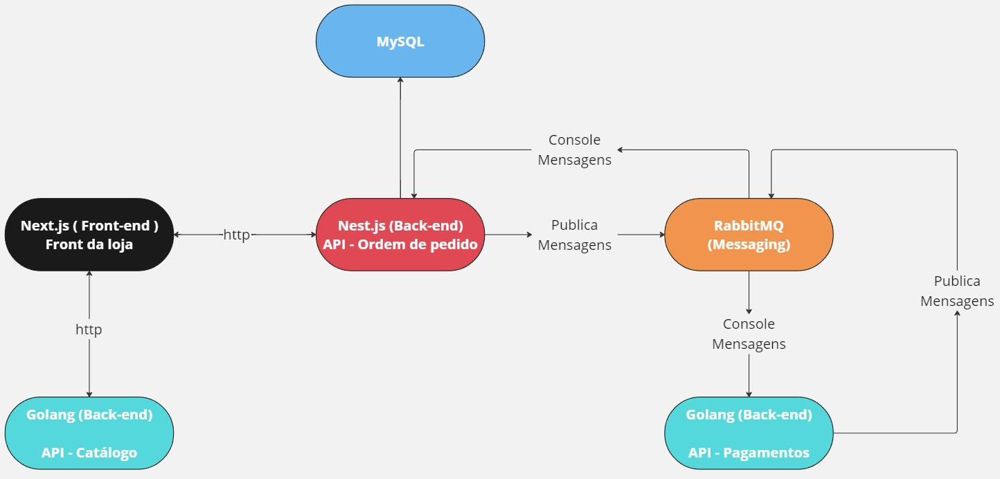

## Description - Project de E-commerce

This project is part of an e-commerce system with the following technologies:

### Technologies

- **Front-end:** <a href="https://github.com/LuizGustav0/nextjs-ecommerce" target="_blank">Next.js</a>
- **Back-end:**
  - **Orders:** <a href="https://github.com/LuizGustav0/nestjs-api-ecommerce-pedidos" target="_blank">Nest.js</a>
  - **Catalog:** <a href="https://github.com/LuizGustav0/go-api-ecommerce" target="_blank">Golang</a>
  - **Payments:** <a href="https://github.com/LuizGustav0/go-api-payments-ecommerce" target="_blank">Golang</a>
- **Messaging:** RabbitMQ
- **Database:** MySQL

### Project diagram

This diagram is essential for understanding the structure and communication between the different elements and/or microservices in the project. Check the repositories above and the ports where it is running.



### Order to run:

### **Catalog:** <a href="https://github.com/LuizGustav0/go-api-ecommerce" target="_blank">Golang</a>

### **Orders:** <a href="https://github.com/LuizGustav0/nestjs-api-ecommerce-pedidos" target="_blank">Nest.js</a>

### **Payments:** <a href="https://github.com/LuizGustav0/go-api-payments-ecommerce" target="_blank">Golang</a>

### **Front-end:** <a href="https://github.com/LuizGustav0/nextjs-ecommerce" target="_blank">Next.js</a>


## install dependences

go mod tidy

## Run service

```bash
cd cmd/payment

go run main.go

```

## Running docker is optional

```bash
docker-compose up -d
```

create queues in -> http://localhost:15672/#/queues
queue name: orders
and
queue name: orders_result

Routing key: and orders_result

register exchanges -> amq.direct -> Bindings

name: orders_result
